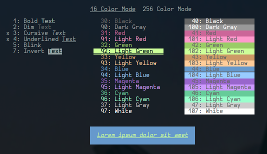
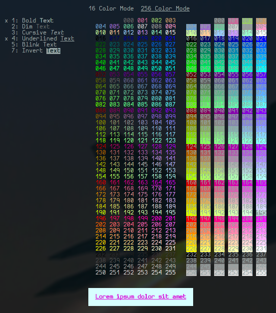

# Colorpicker for Bash
I wrote this ~~little~~ script to generate color combinations for different use cases.
The original idea was to be able to preview color combinations as they can be used with ls, but these escape codes can also be used for many other shell configurations (prompt customization, ...).

This script currently supports mixing 2byte and 8byte colors as well as some attributes that work for me:

# Some features I might add
 - [ ] I already have some support to generate the preview text using `fortune`, I did not test that though. I might implement some way to "type" the preview text.
 - [ ] I want to add a generator for full rgb (16b) colors using `\e[38;2;r;g;bm`.
 - [ ] I want to add a preview gif to the readme that showcases all functionality
